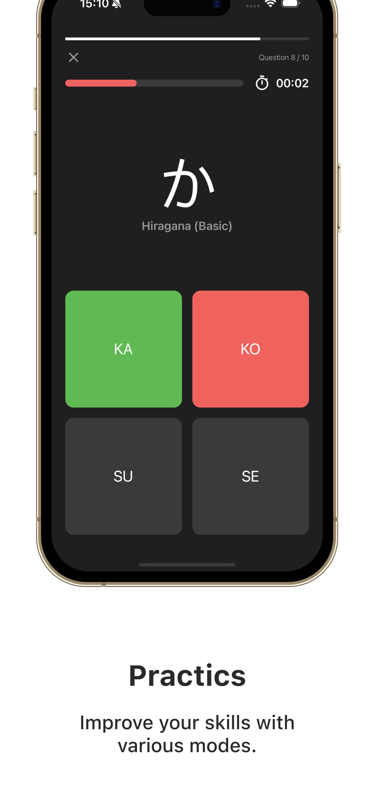
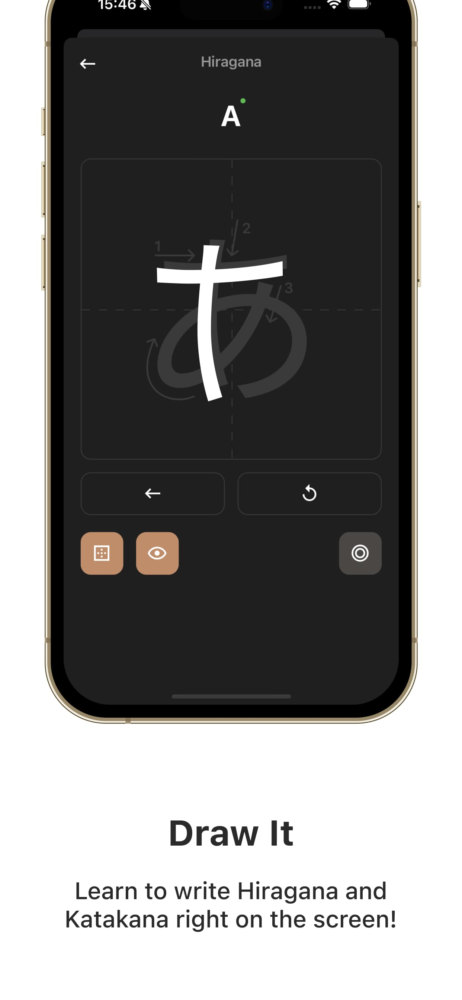

 

  

  <h3 align="center">Kana Master - Learn Japanese</h3>

  

    Kana Master - Learn Japanese" is your reliable guide to mastering the Japanese language.
     
    <a href="https://apps.apple.com/us/app/kana-master-learn-japanese/id6479753061">Apps Store</a>
    ·
    <a href="https://kana-master.khvat.pro/">WebSite</a>
  

### About The Project

<table>
  <tr>
    <td></td>
    <td></td>
    <td></td>
    <td></td>
  </tr>
</table>

<table>
  <tr>
    <td></td>
    <td></td>
    <td></td>
    <td></td>
  </tr>
</table>

**Kana Master** is a mobile application developed using React Native and TypeScript, aimed at facilitating the learning of the Japanese language, specifically the Katakana and Hiragana writing systems. This application is ideal for both beginners and advanced students who are looking to improve their Japanese reading and writing skills.

### Technologies

- **React Native:** For building a cross-platform mobile application.
- **TypeScript:** For type safety and improved code quality.
- **React Navigation:** Used for navigating between screens within the app.
- **Architectural methodology:** Feature-Sliced Design