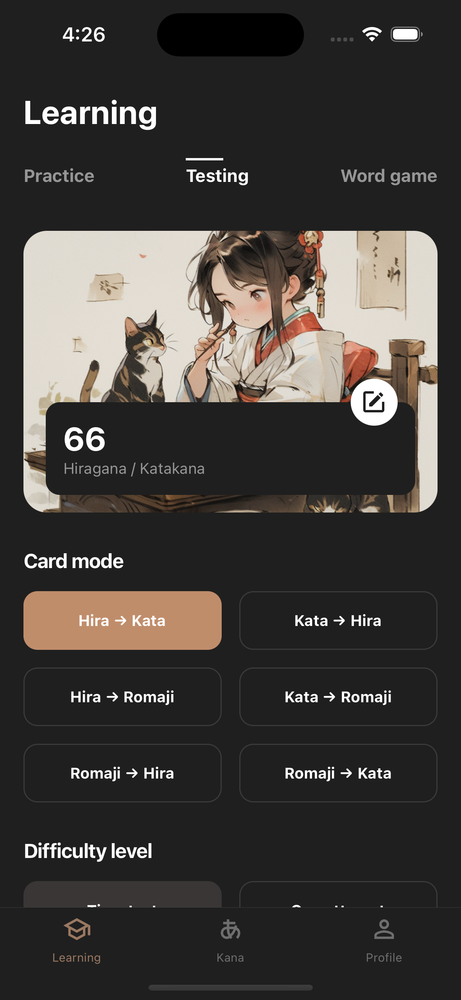
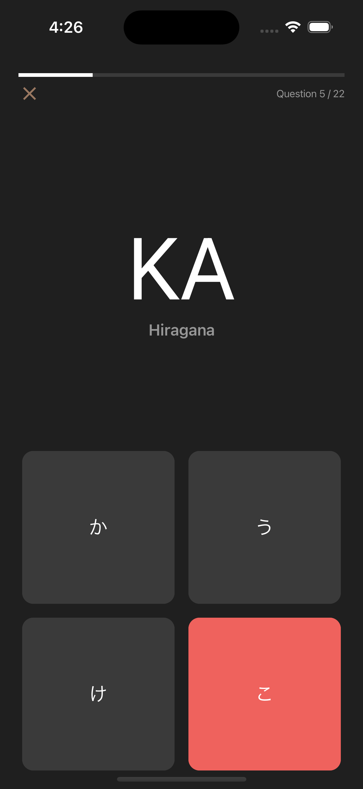
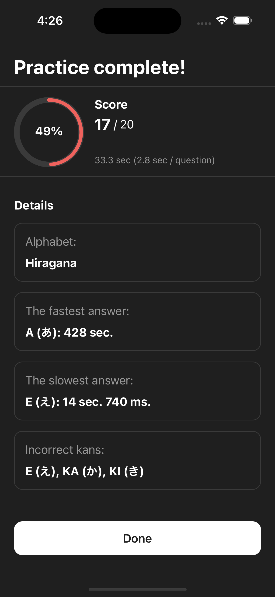
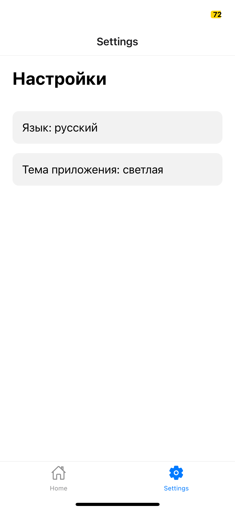
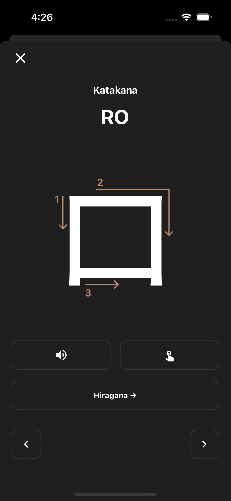

# Nihongo Kana Master

## Description

**Nihongo Kana Master** is a mobile application developed using React Native and TypeScript, aimed at facilitating the learning of the Japanese language, specifically the Katakana and Hiragana writing systems. This application is ideal for both beginners and advanced students who are looking to improve their Japanese reading and writing skills.

## Features

- **Learn Katakana and Hiragana:** Users can study and practice reading and writing Katakana and Hiragana characters.
- **Knowledge Testing:** The app includes tests to assess and reinforce the user's knowledge.
- **Customizable Exercises:** Users can customize exercises to match their knowledge level.
- **Progress Tracking:** Ability to track one's progress in learning.

## Technologies

- **React Native:** For building a cross-platform mobile application.
- **TypeScript:** For type safety and improved code quality.
- **React Navigation:** Used for navigating between screens within the app.

## Screenshots

<table>
  <tr>
    <td></td>
    <td></td>
    <td></td>
    <td></td>
    <td></td>
  </tr>
</table>

## Installation and Running

To run the app locally, follow these steps:

1. Clone the repository:

```sh
git clone https://github.com/nikkhvat/nihongo-kana-master.git
```

2. Install dependencies:

```sh
cd nihongo-kana-master
npm install
```

3. Run the application:


```sh
npm start
```