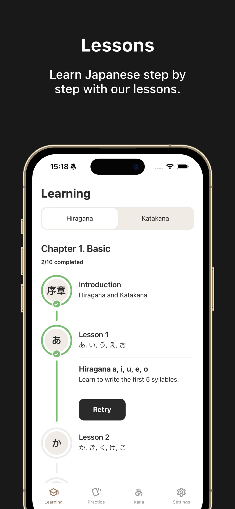
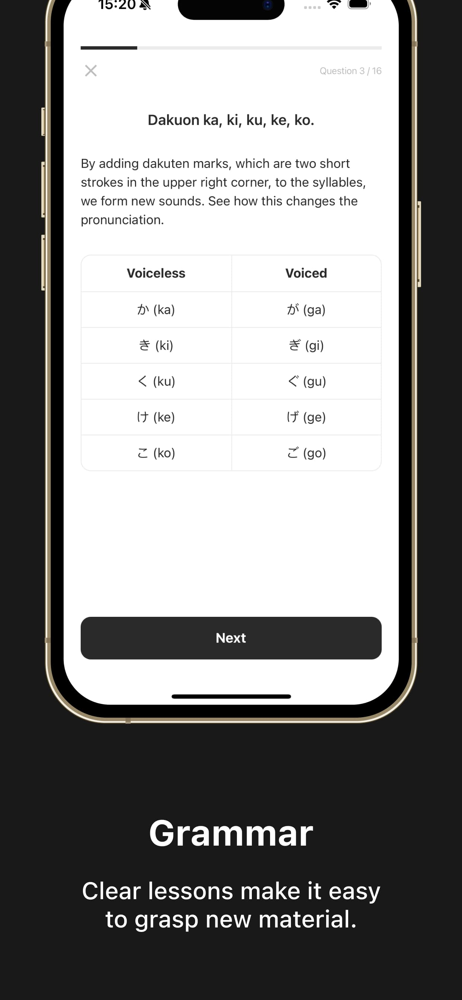
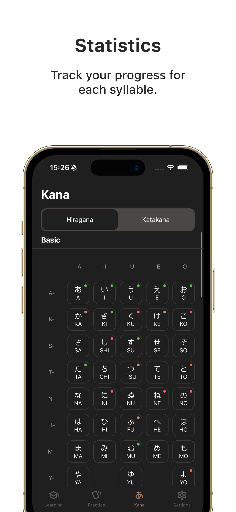
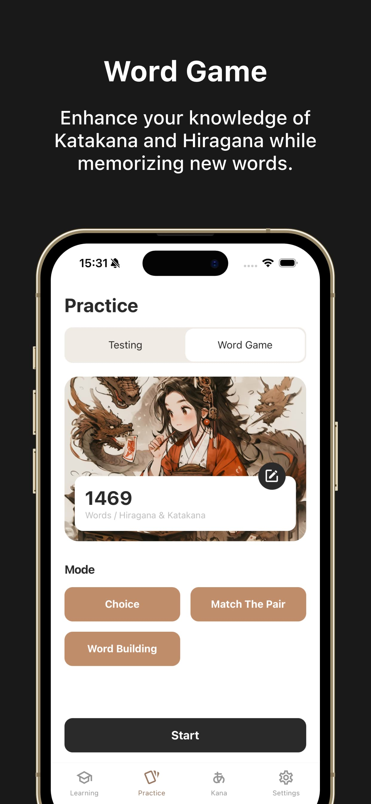
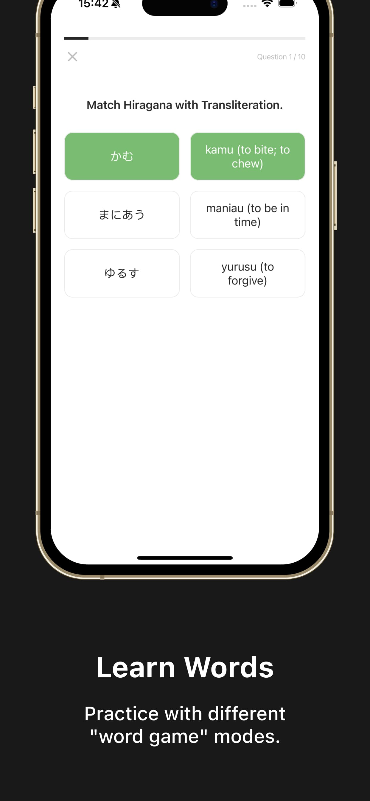

 

  

  <h3 align="center">Kana Master - Изучение Японского</h3>

  

    Kana Master - Изучение Японского  
    Ваш надежный проводник в освоении японского языка.
     
     
    <a href="https://apps.apple.com/us/app/kana-master-learn-japanese/id6479753061">App Store</a>
    ·
    <a href="https://kana-master.khvat.pro/">Веб сайт</a>
    ·
    <a href="https://www.behance.net/gallery/200432749/Mobile-App-Kana-Master">Behance</a>
  

  
  

    <a href="./RU.md">RU</a>
    |
    <a href="../README.md">EN</a>
  

### О Проекте

<table>
  <tr>
    <td></td>
    <td></td>
    <td></td>
    <td></td>
  </tr>
</table>

<table>
  <tr>
    <td></td>
    <td></td>
    <td></td>
    <td></td>
  </tr>
</table>

**Kana Master** — это мобильное приложение, разработанное с использованием React Native и TypeScript, направленное на облегчение изучения японского языка, в частности систем письма катакана и хирагана. Это приложение идеально подходит как для начинающих, так и для продвинутых студентов, которые хотят улучшить свои навыки чтения и письма на японском языке.

### Технологии

- **React Native:** Для создания кроссплатформенного мобильного приложения.
- **TypeScript:** Для безопасности типов и повышения качества кода.
- **React Navigation:** Используется для навигации между экранами в приложении.
- **Архитектурная методология:** Feature-Sliced ​​Design